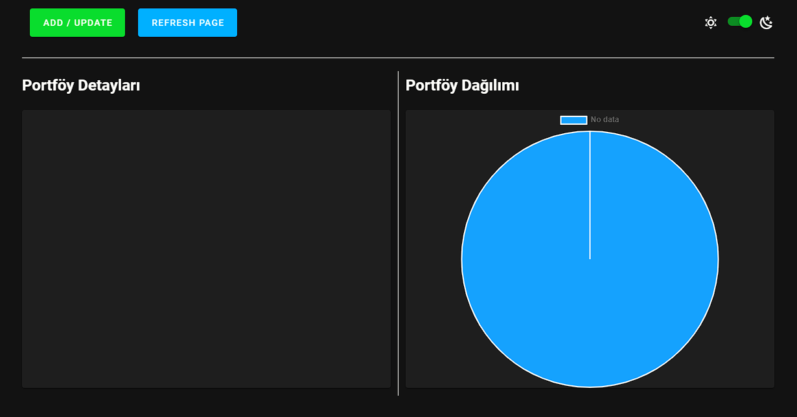
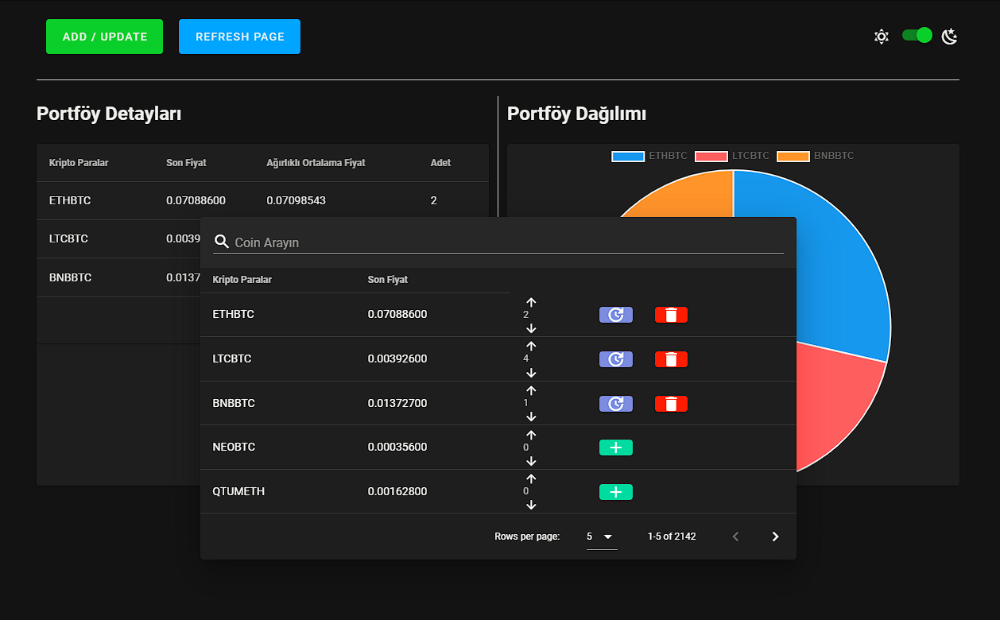
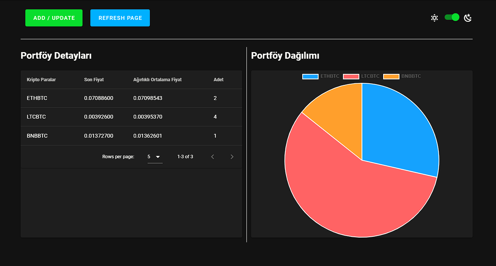
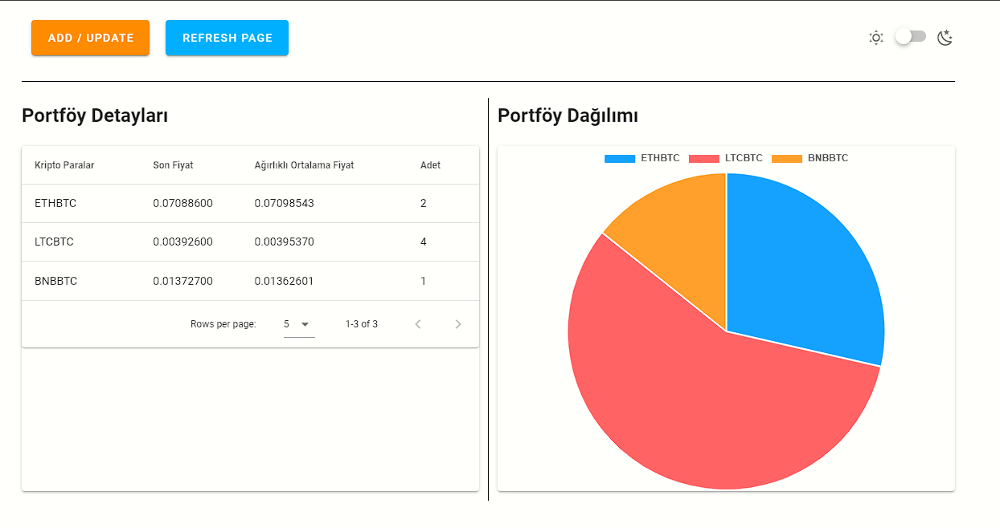

## Built With

Frontend (SPA)

- Used Javascript framework on front-end - [Vue.js](https://vuejs.org/)
- State management pattern on front-end - [Vuex](https://vuex.vuejs.org/)
- Material design framework - [Vuetify](https://vuetifyjs.com/)

Backend (API)

- Binance API - [API](https://api2.binance.com/api/v3/ticker/24hr)

## Project Images






## Project setup
```
npm install
```

### Compiles and hot-reloads for development
```
npm run serve
```

### Compiles and minifies for production
```
npm run build
```

### Lints and fixes files
```
npm run lint
```

### Customize configuration
See [Configuration Reference](https://cli.vuejs.org/config/).
